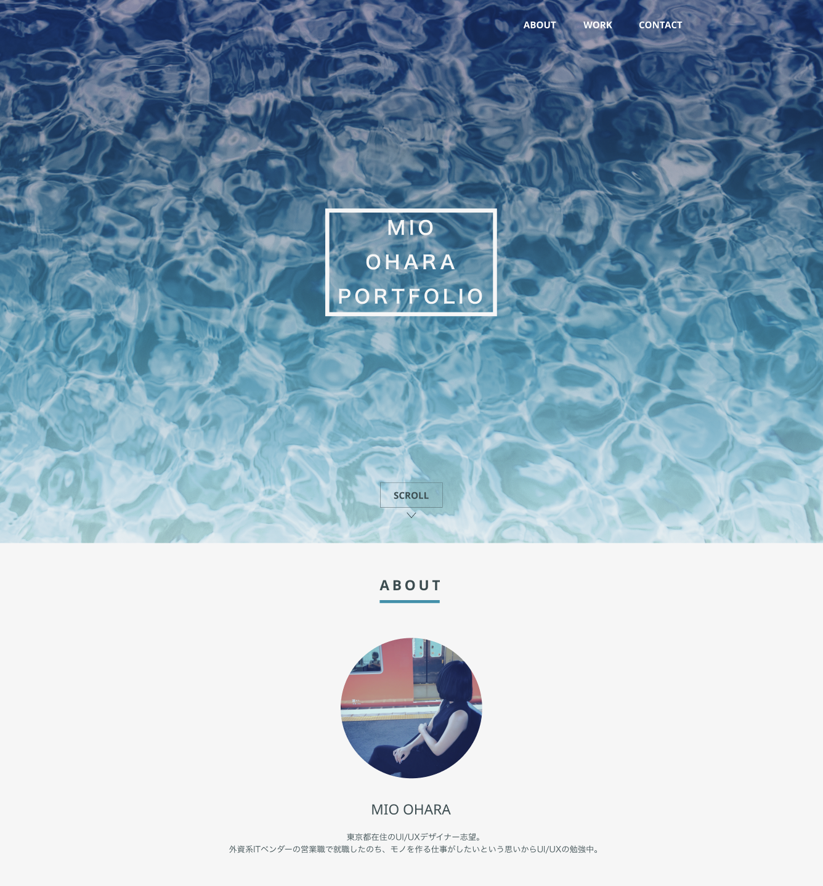

## 要素を洗い出してみよう
 webページのデザインを考える前に、まずはwebページに載せたい情報を洗い出すことが大切です。webページで伝えたい内容、必要と思われる要素を思いつく限り列挙していきましょう。本当に必要な要素かどうかや、要素の関係性などはこの段階で考えなくても大丈夫です。

### ポートフォリオサイトの場合
 ここでは、ポートフォリオサイトを作ることを想定します。ポートフォリオサイトとは、自己紹介と作品紹介を載せたwebページのことです。これまで作成した成果物をアピールして仕事の依頼を受けるために作ります。

 さて、自分と作品を相手に伝えるためにはどんな要素が必要でしょうか。
 - 名前
 - 顔写真
 - 経歴
 - SNSアカウント
 - 性別
 - スキル
 - 出身校
 - 職歴
 - 制作物のスクリーンショット
 - 制作期間
 - 制作における担当範囲
 - メールアドレス
 - 趣味
 - 資格

このように、まずはwebページで伝えたい内容を洗い出すことが最初のステップです。ここで出した要素は次のステップ以降で整理しいきますので、必要だと思うものから書き出していきましょう。

また、この段階ではそれぞれの詳しい内容はこの段階では考えなくても問題ありません。複数人で取り組む場合は、山手線ゲームのように一人一人アイデアを出しあっていくと良いかもしれませんね。
