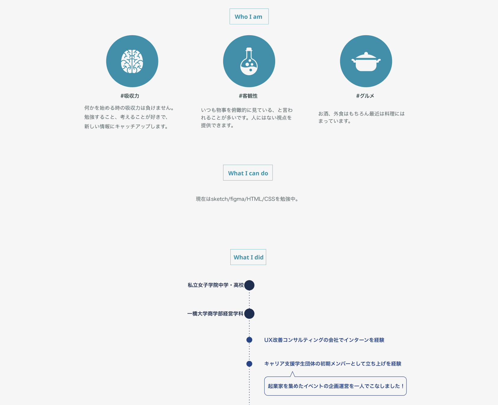

## 洗い出した要素はチャンクに分けて整理しよう
チャンクとは、人間が情報を知覚する時の「情報のまとまり」のことです。先ほど洗い出した情報をいくつかのチャンクに分けて整理してみましょう。すると、バラバラだった情報が意味のあるまとまりに分けられて、内容を理解しやすくなります。webページを見た人に内容を分かりやく伝えるためには、このチャンク分けが必要不可欠です。

### 実際にチャンク分けをしてみよう
前のステップで出した要素を実際にチャンク分けしてみましょう。似たような内容を含む要素を一つのまとまりにして、それぞれのチャンクに名前をつけます。このステップでは、伝えたい内容に応じてチャンクの分け方が異なってくることもあります。正解はありませんので、自分が「コレとコレはまとめて伝えたい」と考える要素同士を一つのチャンクにしてみましょう。

 - 基本情報
 	- 名前
 	- 顔写真
 	- 性別
 	- 趣味
 	- 資格
 	- スキル
 - 経歴
	 - 出身校
	 - 職歴
 - 制作物
	 - 制作物のスクリーンショット
	 - 制作期間
	 - 制作における担当範囲
 - 連絡先
	- SNSアカウント
	- メールアドレス

要素を単に羅列した時に比べて、すんなり情報が頭に入ってくるのではないでしょうか。

ここで分けたチャンクが、画像のような実際のwebページでの構成に繋がります。そのため、この段階で出来るだけ分かりやすくシンプルな構成を心がけましょう。

### 覚えやすい数のチャンクにする
10個や20個とあまりにチャンクが多すぎると、ページを見た人が情報を知覚しきれずに混乱する原因になります。人間が一度に覚えられるチャンクの数は、7±2と言われています。つまり、人間は5~9個の情報しか一度に認識できないということです。チャンク分けをする時はこの数字を意識して、7個程度のチャンクにおさめるようにしましょう。

載せたい要素が多くなる場合は、複数のチャンクを一つのグループにまとめて、より大きなチャンクを作りましょう。そうすることで、情報が多くても覚えてもらいやすくなります。
