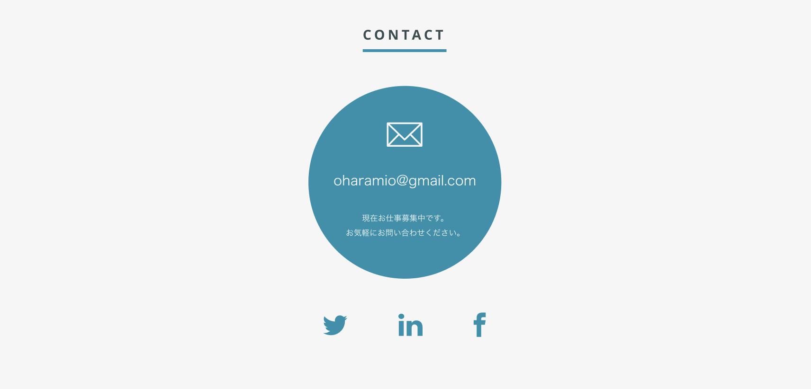
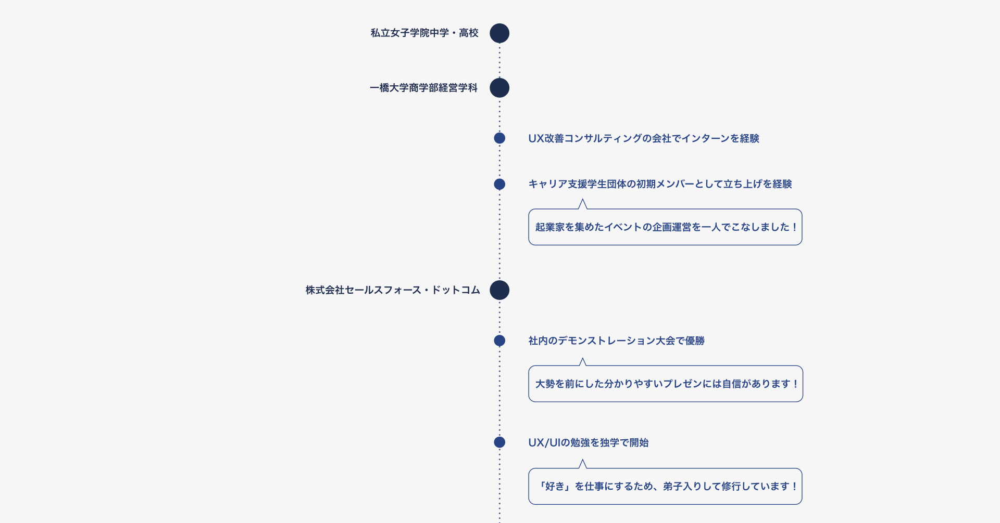

## チャンクに優先順位を付けて整理しよう
分かりやすい構成のwebページにするには、載せる情報に優先順位を付ける必要があります。最も伝えたい情報は目立つように大きく配置し、そうでない要素は控えめに配置するなどの工夫が大切です。前のステップで分けたチャンクを改めて見てみてください。全ての要素を一律に羅列した状態では、何が大事なのかを判別するのが難しいのではないでしょうか。それでは、前のステップで分けたチャンクに優先順位をつけていくことで、大事な情報を伝えやすくしましょう。

### 実際に優先順位を付けよう
優先順位をつけるときは、同じ順位の要素があっても構いません。今回の例では、大きなグループのチャンクはⅠからⅢの順位に分け、その中の要素は①から③の順位に分けました。

Ⅰ. 基本情報
 - ① 名前
 - ② 顔写真
 - ② 性別
 - ③ 趣味
 - ③ 資格
 - ③ スキル

Ⅱ. 経歴
  - ① 出身校
  - ① 職歴

Ⅱ. 制作物
  - ① 制作物のスクリーンショット
  - ② 制作期間
  - ② 制作における担当範囲

Ⅲ. 連絡先
  - ① メールアドレス
  - ② SNSアカウント

ここで付けた優先順位に応じてwebページ上の見た目の方向性が決まってきます。優先順位の高い要素は、目立たせるために大きくしたりページの上部に持ってくる必要があります。また、同じ優先順位の要素は、同じレベルの見た目にするために文字の色やサイズを揃える必要が出てきます。

優先順位の高い連絡先情報は大きく、優先順位の低いSNSアイコンは小さめに配置します。

同じ優先順位の出身校と職歴は一本の線上に配置して、差が出ないようにしています。

それでは、次のステップで見た目の整え方の原則を具体的に学んでいきましょう。
